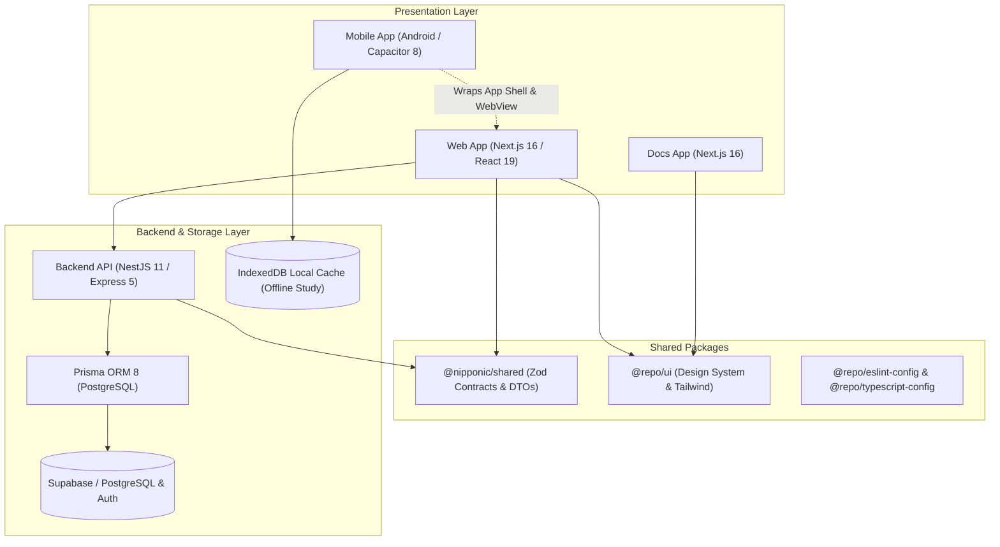
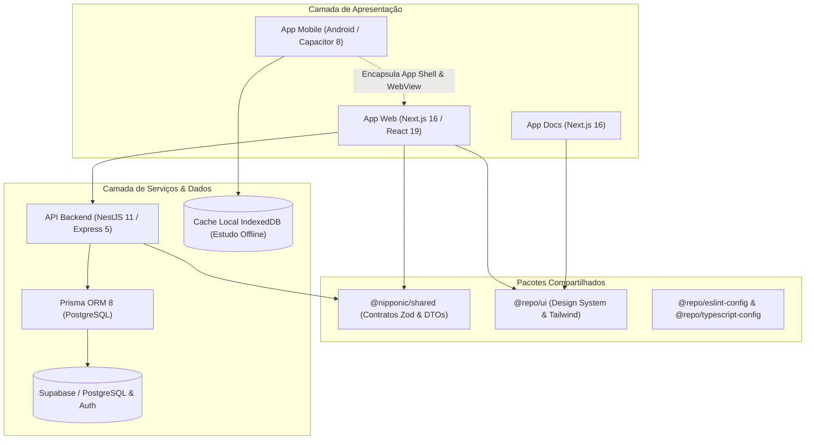

<div align="center">
  <h1 align="center">🇯🇵 Nipponic</h1>
  <p align="center">
    <b>Complete and Modern Platform for Self-Taught Japanese Learning</b>
  </p>
  <p align="center">
    <a href="#about-the-project">About</a> •
    <a href="#key-features">Key Features</a> •
    <a href="#system-architecture">Architecture</a> •
    <a href="#technologies-used">Technologies</a> •
    <a href="#getting-started-local-development">Getting Started</a> •
    <a href="#mobile-development-capacitor-android">Mobile</a> •
    <a href="#running-with-docker">Docker</a> •
    <a href="#useful-commands">Commands</a> •
    <a href="#contribution-guide">Contribution</a> •
    <a href="#license">License</a>
  </p>

  <p align="center">
    
    
    
    
    
    
    
    
    
    
  </p>
</div>

---

## 📖 About the Project

**Nipponic** is a high-performance educational ecosystem engineered specifically for self-taught learners who want to master the Japanese language autonomously, efficiently, and interactively.

By unifying **spaced repetition algorithms (SRS)**, **morphological tokenization with furigana generation**, **intelligent dual-language notes**, **native mobile encapsulation**, and **robust offline study capabilities**, Nipponic delivers a frictionless immersion and vocabulary retention experience across web and mobile platforms.

---

## ✨ Key Features

### 📱 Mobile & Offline-First (Capacitor Android)

- **Native Android Encapsulation:** Packaged via Capacitor 8 with edge-to-edge display, dynamic dark status bar, safe area inset handling, and native hardware back-button routing (modal dismissal & app minimization).
- **Cold-Start Offline Resilience:** Custom `MainActivity.java` dynamically enables `WebSettings.LOAD_CACHE_ELSE_NETWORK` in offline conditions, combined with Service Worker asset precaching and an offline fallback page.
- **Offline Study Sessions:** Study your flashcard decks anywhere without network access using local IndexedDB caching.
- **Background Sync Queue:** Reviews completed offline are safely queued locally and automatically synchronized with the backend when internet connectivity is restored.
- **Scheduled Native Notifications:** Built-in daily study reminders powered by `@capacitor/local-notifications` to maintain study streaks.

### 🧠 Spaced Repetition System (SRS) & Flashcards

- **SuperMemo SM-2 Algorithm:** Proven spaced repetition engine calculating optimal intervals, ease factors, repetitions, and due dates.
- **Interactive Player:** Study sessions equipped with keyboard shortcuts, flip animation, rating buttons (_Again_, _Hard_, _Good_, _Easy_), and confetti celebration upon deck completion.
- **Flexible Deck Management:** Create private decks, explore curated app decks, manage public decks, reorder cards, and filter cards by due status.

### 📝 Intelligent Japanese Notes & Sentence Mining

- **Dual-Language Workspace:** Write and edit Japanese and English/Portuguese text side-by-side or stacked.
- **Kuromoji Morphological Analysis:** Real-time Japanese tokenization that generates dynamic furigana over kanji and enables interactive hover/click dictionary definitions.
- **In-Depth Kanji Breakdown:** Instant lookup of On'yomi, Kun'yomi, Nanori readings, JLPT levels (N5–N1), stroke count, school grades, unicode, and Heisig keywords.
- **One-Click Sentence Mining:** Generate flashcards directly from note sentences, automatically capturing definitions and assigning them to multiple decks with search filtering.
- **Custom Translation Glossary:** Define personalized translation rules and terminology overrides.

### 🗣️ Shadowing & Text-to-Speech (TTS)

- **Natural Audio Playback:** Text-to-Speech synthesis with sentence chunking and voice fallback for clear pronunciation.
- **Dedicated Shadowing Modal:** Practice listening and repeating natural Japanese sentences with fine-grained playback controls.

### ☕ Community & GitHub Sponsors

- **Voluntary Supporter Tiers:** Integrated GitHub Sponsors support with tiers (🌱 _Green Tea_, 🍱 _Bento Box_, 🍜 _Premium Ramen_).
- **Supporters Wall:** Recognition for contributors with linked GitHub profiles and supporter badges.

### 🐳 Docker & Cloud Ready

- **Docker Containerization:** Docker and Docker Compose configurations for both local live-reload development and production standalone runners.
- **Oracle Cloud Deployment:** Dedicated guide for running on Oracle Cloud Infrastructure (OCI) Free Tier VMs ([DEPLOY_ORACLE_CLOUD.md](DEPLOY_ORACLE_CLOUD.md)).
- **Cold-Start Overlay:** Built-in visual indicator and ping handler for sleeping free-tier API services.

---

## 🏛️ System Architecture

The project is structured as a **Monorepo** managed with Turborepo and pnpm workspaces, enforcing strong typing, modularity, and code sharing between Web, Mobile, and API:



---

## 🧰 Technologies Used

- **Monorepo:** [Turborepo](https://turborepo.dev/) & [pnpm workspaces](https://pnpm.io/)
- **Frontend:** [Next.js 16](https://nextjs.org/) (App Router), [React 19](https://react.dev/), [Tailwind CSS v4](https://tailwindcss.com/)
- **Mobile:** [Capacitor 8](https://capacitorjs.com/), [Android SDK](https://developer.android.com/)
- **Backend:** [NestJS 11](https://nestjs.com/), [Express 5](https://expressjs.com/), [Node.js](https://nodejs.org/)
- **Database & ORM:** [Prisma ORM 8](https://www.prisma.io/), [Supabase](https://supabase.com/) (PostgreSQL + Row Level Security)
- **Japanese NLP:** [Kuromoji.js](https://github.com/takuyaa/kuromoji.js) (Morphological Analysis)
- **Shared Layer:** `@nipponic/shared` powered by [Zod](https://zod.dev/) for contract validation
- **Testing:** [Vitest](https://vitest.dev/), Testing Library, `@vitest/coverage-v8`, `fake-indexeddb`
- **Containerization:** [Docker](https://www.docker.com/) & Docker Compose

---

## 🚀 Getting Started (Local Development)

### Prerequisites

Ensure you have the following installed on your system:

- [Node.js](https://nodejs.org/) (v18 or higher)
- [pnpm](https://pnpm.io/) (v9 or higher recommended)
- [Git](https://git-scm.com/)
- _(Optional for mobile development)_ [Android Studio](https://developer.android.com/studio) with Android SDK and JDK 17+

### 1. Clone the Repository

```bash
git clone https://github.com/WeltonSantosFr/nipponic.git
cd nipponic
```

### 2. Install Dependencies

Install all monorepo dependencies:

```bash
pnpm install
```

### 3. Configure Environment Variables

Create `.env.local` in `apps/web` and `.env` in `apps/api` following the example files:

```bash
# In apps/api
cp apps/api/.env.example apps/api/.env

# In apps/web
cp apps/web/.env.example apps/web/.env.local
```

### 4. Run in Development Mode

Run all applications and packages concurrently with Turborepo:

```bash
pnpm dev
```

- **Web App:** [http://localhost:3000](http://localhost:3000)
- **Backend API:** [http://localhost:3333](http://localhost:3333)
- **Docs:** [http://localhost:8080](http://localhost:8080)

---

## 📱 Mobile Development (Capacitor Android)

Nipponic uses Capacitor to package the web application as a native Android application.

### Mobile Workflow Commands

Run these commands from the monorepo root:

```bash
# Sync web build assets and Capacitor plugins with the native Android project
pnpm android:sync

# Open the Android project in Android Studio
pnpm android:open

# Build the Android debug APK via Gradle
pnpm android:build
```

### Local Testing with Android Emulator

To point the Capacitor Android app to your local development machine:

```bash
# In apps/web
CAPACITOR_SERVER_URL=http://10.0.2.2:3000 pnpm run cap:sync:dev
```

_(Note: `10.0.2.2` is the special Android emulator alias for your host machine's `localhost`)_.

---

## 🐳 Running with Docker

Nipponic provides Docker support for containerized development and production deployments.

### Local Development (Live Reload)

```bash
# Start all services with live reload
pnpm run docker:dev
# or: docker compose up --build

# Start only the API
docker compose up --build api

# Stop containers
pnpm run docker:down
# or: docker compose down
```

### Production Build

```bash
# Build and run production containers in background
pnpm run docker:prod
# or: docker compose -f docker-compose.prod.yml up --build -d
```

For step-by-step guidance on deploying to a Virtual Machine on **Oracle Cloud (OCI)**, see the [Oracle Cloud Deployment Guide](DEPLOY_ORACLE_CLOUD.md).

---

## 🛠️ Useful Commands

| Command              | Description                                                  |
| :------------------- | :----------------------------------------------------------- |
| `pnpm dev`           | Starts all applications in development mode with live reload |
| `pnpm build`         | Compiles all monorepo packages and applications              |
| `pnpm lint`          | Runs ESLint across all packages and apps                     |
| `pnpm format`        | Formats code with Prettier                                   |
| `pnpm check-types`   | Performs TypeScript static type checking across the monorepo |
| `pnpm test`          | Runs unit and integration test suites using Vitest           |
| `pnpm test:cov`      | Runs tests and generates test coverage reports               |
| `pnpm android:sync`  | Syncs web assets and plugins to the native Android project   |
| `pnpm android:open`  | Opens the Android project in Android Studio                  |
| `pnpm android:build` | Compiles the Android debug APK via Gradle                    |
| `pnpm docker:dev`    | Starts development containers with live reload               |
| `pnpm docker:prod`   | Starts standalone production containers                      |
| `pnpm docker:down`   | Stops and removes active Docker containers                   |

---

## 🤝 Contribution Guide

Contributions are welcome! If you want to contribute to Nipponic:

1. **Fork** the repository.
2. Create a feature branch (`git checkout -b feature/amazing-feature`).
3. Commit your changes (`git commit -m 'feat: add amazing feature'`).
4. **Push** to your branch (`git push origin feature/amazing-feature`).
5. Open a **Pull Request**.

Please ensure your changes pass type checks, tests, and linting (`pnpm check-types`, `pnpm test`, and `pnpm lint`) before submitting.

---

## 📄 License

This project is licensed under the [MIT](LICENSE) License. See the license file for details.

---

---

<div align="center">
  <h1 align="center">🇯🇵 Nipponic</h1>
  <p align="center">
    <b>Plataforma Completa e Moderna para Aprendizado Autodidata de Japonês</b>
  </p>
  <p align="center">
    <a href="#sobre-o-projeto">Sobre</a> •
    <a href="#funcionalidades-principais">Funcionalidades</a> •
    <a href="#arquitetura-do-sistema">Arquitetura</a> •
    <a href="#tecnologias-utilizadas">Tecnologias</a> •
    <a href="#começando-desenvolvimento-local">Começando</a> •
    <a href="#desenvolvimento-mobile-capacitor-android">Mobile</a> •
    <a href="#executando-com-docker">Docker</a> •
    <a href="#comandos-úteis">Comandos</a> •
    <a href="#guia-de-contribuição">Contribuição</a> •
    <a href="#licença">Licença</a>
  </p>

  <p align="center">
    
    
    
    
    
    
    
    
    
    
  </p>
</div>

---

## 📖 Sobre o Projeto

O **Nipponic** é um ecossistema educacional de alta performance projetado especificamente para falantes de português que desejam dominar o idioma japonês de forma autônoma, eficiente e interativa.

Unindo **algoritmos de repetição espaçada (SRS)**, **tokenização morfológica com furigana dinâmico**, **anotações inteligentes bilíngues**, **encapsulamento nativo para dispositivos móveis** e **recursos robustos de estudo offline**, o Nipponic oferece uma experiência completa de imersão e retenção de vocabulário tanto na Web quanto em smartphones Android.

---

## ✨ Funcionalidades Principais

### 📱 Experiência Mobile & Offline-First (Capacitor Android)

- **Encapsulamento Nativo Android:** Empacotado via Capacitor 8 com exibição edge-to-edge, barra de status escura dinâmica, tratamento de safe areas e controle nativo do botão voltar do hardware (fechamento de modais abertos e minimização do app).
- **Cold-Start Resiliente no Modo Offline:** Configuração dinâmica de cache no `MainActivity.java` (`WebSettings.LOAD_CACHE_ELSE_NETWORK`) para garantir carregamento instantâneo do shell e assets mesmo sem conexão com a internet, complementado por Service Worker e tela de fallback PWA.
- **Sessões de Estudo Offline:** Revise seus decks de flashcards em qualquer lugar, mesmo sem internet, utilizando armazenamento local em IndexedDB.
- **Fila de Sincronização em Segundo Plano:** As revisões realizadas offline são gravadas localmente e enviadas automaticamente para a API assim que a conexão de rede for restabelecida (`offline-sync`).
- **Lembretes Diários via Notificações Locais:** Lembretes de estudo agendados nativamente via `@capacitor/local-notifications` para manter a consistência da rotina de aprendizado.

### 🧠 Sistema de Repetição Espaçada (SRS) & Flashcards

- **Algoritmo SuperMemo SM-2:** Motor matemático que calcula automaticamente o momento ideal de revisão, ajustando intervalos, fator de facilidade (ease factor), repetições e lapsos.
- **Player Interativo de Flashcards:** Sessões de estudo dinâmicas com atalhos de teclado, animação 3D de flip, botões de classificação (_Novamente_, _Difícil_, _Bom_, _Fácil_) e celebração com confetes ao concluir a rodada.
- **Gestão Flexível de Decks:** Crie decks privados, explore decks padrão do aplicativo, compartilhe decks públicos, reordene cartões e filtre por status de revisão (_todos_ ou _pendentes_).

### 📝 Anotações Inteligentes em Japonês & Mineração de Frases (Sentence Mining)

- **Editor Duplo de Anotações:** Escreva e organize conteúdos em japonês e português/inglês lado a lado ou empilhados.
- **Análise Morfológica Kuromoji:** Tokenização em tempo real de textos em japonês, gerando furigana sobre kanjis e permitindo consulta instantânea de significados no dicionário com hover ou clique.
- **Decomposição Detalhada de Kanjis:** Consulta rápida de leituras On'yomi, Kun'yomi e Nanori, níveis do JLPT (N5 ao N1), contagem de traços, grau escolar, código unicode e palavras-chave do método Heisig.
- **Mineração de Frases em Um Clique:** Crie flashcards instantaneamente a partir de frases do seu caderno de anotações, capturando a definição da palavra e associando-a a múltiplos decks com filtro de busca.
- **Glossário Personalizado de Tradução:** Crie regras de tradução sob medida e termos personalizados para traduções sob medida.

### 🗣️ Shadowing & Síntese de Voz (TTS)

- **Áudio Japonês Natural:** Síntese de fala com divisão inteligente em sentenças (_chunking_) e fallback de vozes para reprodução fluida.
- **Modal Dedicado de Shadowing:** Treine escuta ativa e pronúncia em voz alta repetindo frases nativas com controle de velocidade e pausa.

### ☕ Apoio da Comunidade & GitHub Sponsors

- **Tiers Temáticos de Apoio:** Integração com GitHub Sponsors com níveis temáticos (🌱 _Green Tea_, 🍱 _Bento Box_, 🍜 _Premium Ramen_).
- **Mural de Apoiadores:** Reconhecimento público na plataforma para os apoiadores com perfil do GitHub e badges exclusivos.

### 🐳 Docker & Pronto para Nuvem

- **Containerização Completa:** Arquivos Docker e Docker Compose configurados tanto para desenvolvimento local (live reload) quanto para produção otimizada.
- **Guia de Implantação na Oracle Cloud:** Roteiro detalhado para deploy da API e Web em máquina virtual no plano gratuito da Oracle Cloud (OCI) ([DEPLOY_ORACLE_CLOUD.md](DEPLOY_ORACLE_CLOUD.md)).
- **Overlay de Inicialização (Cold-Start):** Indicador visual interativo que monitora o despertar de servidores em instâncias gratuitas da nuvem.

---

## 🏛️ Arquitetura do Sistema

O projeto adota uma arquitetura **Monorepo** gerenciada com Turborepo e pnpm workspaces, garantindo reaproveitamento de código, tipagem fim a fim e contratos estritos entre Web, Mobile e Backend:



---

## 🧰 Tecnologias Utilizadas

- **Monorepo:** [Turborepo](https://turborepo.dev/) & [pnpm workspaces](https://pnpm.io/)
- **Frontend:** [Next.js 16](https://nextjs.org/) (App Router), [React 19](https://react.dev/), [Tailwind CSS v4](https://tailwindcss.com/)
- **Mobile:** [Capacitor 8](https://capacitorjs.com/), [Android SDK](https://developer.android.com/)
- **Backend:** [NestJS 11](https://nestjs.com/), [Express 5](https://expressjs.com/), [Node.js](https://nodejs.org/)
- **Banco de Dados & ORM:** [Prisma ORM 8](https://www.prisma.io/), [Supabase](https://supabase.com/) (PostgreSQL + RLS)
- **Processamento de Japonês:** [Kuromoji.js](https://github.com/takuyaa/kuromoji.js) (Análise Morfológica)
- **Camada Compartilhada:** `@nipponic/shared` com validação de schemas via [Zod](https://zod.dev/)
- **Testes:** [Vitest](https://vitest.dev/), Testing Library, `@vitest/coverage-v8`, `fake-indexeddb`
- **Containerização:** [Docker](https://www.docker.com/) & Docker Compose

---

## 🚀 Começando (Desenvolvimento Local)

### Pré-requisitos

Certifique-se de ter instalado em sua máquina:

- [Node.js](https://nodejs.org/) (versão 18 ou superior)
- [pnpm](https://pnpm.io/) (versão 9 ou superior recomendada)
- [Git](https://git-scm.com/)
- _(Opcional para desenvolvimento mobile)_ [Android Studio](https://developer.android.com/studio) com Android SDK e JDK 17+

### 1. Clonando o Repositório

```bash
git clone https://github.com/WeltonSantosFr/nipponic.git
cd nipponic
```

### 2. Instalando as Dependências

Instale todas as dependências do monorepo:

```bash
pnpm install
```

### 3. Configurando as Variáveis de Ambiente

Crie os arquivos `.env.local` em `apps/web` e `.env` em `apps/api` baseando-se nos exemplos:

```bash
# Na API
cp apps/api/.env.example apps/api/.env

# No Web
cp apps/web/.env.example apps/web/.env.local
```

### 4. Executando em Modo de Desenvolvimento

Inicie todas as aplicações e pacotes concorrentemente via Turborepo:

```bash
pnpm dev
```

- **App Web:** [http://localhost:3000](http://localhost:3000)
- **API Backend:** [http://localhost:3333](http://localhost:3333)
- **Documentação:** [http://localhost:8080](http://localhost:8080)

---

## 📱 Desenvolvimento Mobile (Capacitor Android)

O Nipponic utiliza o Capacitor para encapsular a aplicação Web em um aplicativo nativo Android.

### Comandos de Workflow Mobile

Execute estes comandos a partir da raiz do monorepo:

```bash
# Sincroniza os assets e plugins do Capacitor com o projeto Android nativo
pnpm android:sync

# Abre o projeto Android no Android Studio
pnpm android:open

# Compila o APK de depuração via Gradle
pnpm android:build
```

### Testando Localmente no Emulador Android

Para apontar o aplicativo Capacitor para o servidor de desenvolvimento na sua máquina local:

```bash
# Dentro de apps/web
CAPACITOR_SERVER_URL=http://10.0.2.2:3000 pnpm run cap:sync:dev
```

_(Observação: `10.0.2.2` é o endereço especial do emulador Android para acessar o `localhost` do computador host)_.

---

## 🐳 Executando com Docker

O Nipponic oferece suporte a Docker tanto para desenvolvimento com hot-reload quanto para deploy em produção.

### Desenvolvimento Local (Live Reload)

```bash
# Iniciar todos os serviços com live reload
pnpm run docker:dev
# ou: docker compose up --build

# Iniciar apenas o container da API
docker compose up --build api

# Parar os containers
pnpm run docker:down
# ou: docker compose down
```

### Build de Produção

```bash
# Compilar e iniciar containers de produção em segundo plano
pnpm run docker:prod
# ou: docker compose -f docker-compose.prod.yml up --build -d
```

Para o passo a passo completo de implantação em Máquina Virtual na **Oracle Cloud (OCI)**, consulte o [Guia de Deploy na Oracle Cloud](DEPLOY_ORACLE_CLOUD.md).

---

## 🛠️ Comandos Úteis

| Comando              | Descrição                                                             |
| :------------------- | :-------------------------------------------------------------------- |
| `pnpm dev`           | Inicia todas as aplicações em modo de desenvolvimento com live reload |
| `pnpm build`         | Compila todos os pacotes e aplicações do monorepo                     |
| `pnpm lint`          | Executa o linter ESLint em todo o código-fonte                        |
| `pnpm format`        | Formata todo o código com Prettier                                    |
| `pnpm check-types`   | Executa a verificação estática de tipos TypeScript                    |
| `pnpm test`          | Executa as suítes de testes unitários e de integração com Vitest      |
| `pnpm test:cov`      | Executa os testes e gera relatório de cobertura                       |
| `pnpm android:sync`  | Sincroniza o build e plugins com o projeto nativo Android             |
| `pnpm android:open`  | Abre o projeto Android no Android Studio                              |
| `pnpm android:build` | Compila o APK Android de depuração via Gradle                         |
| `pnpm docker:dev`    | Inicia os containers de desenvolvimento com live reload               |
| `pnpm docker:prod`   | Inicia os containers de produção standalone                           |
| `pnpm docker:down`   | Para e remove os containers Docker ativos                             |

---

## 🤝 Guia de Contribuição

Contribuições são sempre bem-vindas! Se você deseja ajudar a evoluir o Nipponic:

1. Faça um **Fork** do repositório.
2. Crie uma branch para sua funcionalidade (`git checkout -b feature/minha-feature`).
3. Faça o commit das suas alterações (`git commit -m 'feat: adiciona recurso incrível'`).
4. Faça o **Push** para sua branch (`git push origin feature/minha-feature`).
5. Abra um **Pull Request**.

Certifique-se de que os testes, tipos e linter passem com sucesso (`pnpm check-types`, `pnpm test` e `pnpm lint`) antes de enviar o PR.

---

## 📄 Licença

Este projeto é distribuído sob a licença [MIT](LICENSE). Consulte o arquivo de licença para mais detalhes.
