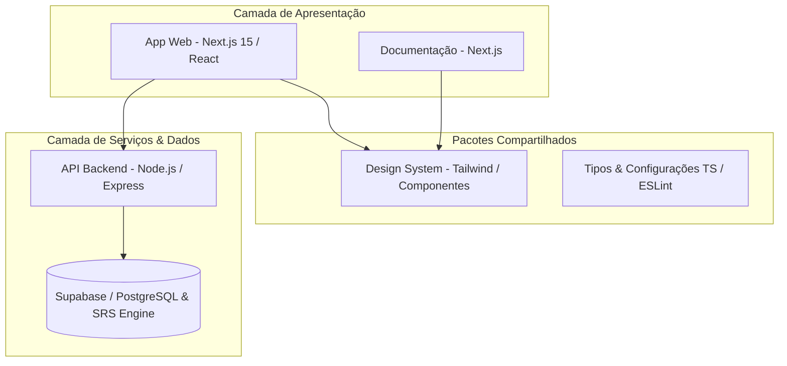

<div align="center">
  <h1 align="center">🇯🇵 Nipponic</h1>
  <p align="center">
    <b>Plataforma Completa e Moderna para Aprendizado Autodidata de Japonês</b>
  </p>
  <p align="center">
    <a href="#sobre-o-projeto">Sobre</a> •
    <a href="#arquitetura">Arquitetura</a> •
    <a href="#tecnologias">Tecnologias</a> •
    <a href="#começando">Começando</a> •
    <a href="#executando-com-docker">Docker</a> •
    <a href="#contribuição">Contribuição</a> •
    <a href="#licença">Licença</a>
  </p>

  <p align="center">
    
    
    
    
    
    
    
  </p>
</div>

---

## 📖 Sobre o Projeto

O **Nipponic** é um ecossistema educacional de alta performance projetado especificamente para falantes de português que desejam dominar o idioma japonês de forma autônoma, eficiente e interativa. 

Combinando algoritmos modernos de repetição espaçada (SRS), dicionário integrado de kanji com análise de furigana, painel de anotações inteligentes e flashcards interativos, o Nipponic oferece uma experiência fluida de imersão e retenção de vocabulário.

---

## 🏛️ Arquitetura do Sistema

O projeto é estruturado como um **Monorepo** gerenciado via Turborepo, garantindo isolamento de pacotes, reaproveitamento de componentes e tipagem estrita de ponta a ponta.



---

## 🧰 Tecnologias Utilizadas

O stack tecnológico foi escolhido priorizando escalabilidade, tipagem forte e excelente experiência de desenvolvimento:

* **Monorepo:** [Turborepo](https://turborepo.dev/) & [pnpm workspaces](https://pnpm.io/)
* **Frontend:** [Next.js 15](https://nextjs.org/), [React](https://react.dev/), [Tailwind CSS](https://tailwindcss.com/)
* **Backend:** [Node.js](https://nodejs.org/), [Express](https://expressjs.com/), [TypeScript](https://www.typescriptlang.org/)
* **Banco de Dados & Auth:** [Supabase](https://supabase.com/) (PostgreSQL + Row Level Security)
* **Qualidade de Código:** [ESLint](https://eslint.org/), [Prettier](https://prettier.io/)

---

## 🚀 Começando (Desenvolvimento Local)

### Pré-requisitos

Certifique-se de ter as seguintes ferramentas instaladas em sua máquina:
* [Node.js](https://nodejs.org/) (versão 18 ou superior)
* [pnpm](https://pnpm.io/) (versão 9 ou superior recomendada)
* [Git](https://git-scm.com/)

### 1. Clonando o Repositório

```bash
git clone https://github.com/seu-usuario/nipponic.git
cd nipponic
```

### 2. Instalando as Dependências

Instale todas as dependências do monorepo executando:

```bash
pnpm install
```

### 3. Configurando as Variáveis de Ambiente

Crie os arquivos `.env.local` e `.env` necessários baseando-se nos exemplos de cada app (`apps/web`, `apps/api`) e configure suas chaves do Supabase e variáveis do backend.

### 4. Executando em Modo de Desenvolvimento

Para rodar todos os aplicativos e pacotes simultaneamente via Turborepo:

```bash
pnpm dev
```

---

## 🐳 Executando com Docker

O Nipponic suporta containerização para facilitar o deploy e homologação em ambientes isolados.

```bash
# Construir e subir os containers do projeto
docker compose up --build -d
```

Para encerrar os serviços:
```bash
docker compose down
```

---

## 🛠️ Comandos Úteis do Turborepo

| Comando | Descrição |
| :--- | :--- |
| `pnpm dev` | Inicia todos os aplicativos em modo de desenvolvimento |
| `pnpm build` | Compila todos os pacotes e aplicativos do monorepo |
| `pnpm lint` | Executa o linter em todo o código-fonte |
| `pnpm format` | Formata o código utilizando o Prettier |
| `pnpm check-types` | Executa a verificação estática de tipos TypeScript |

---

## 🤝 Guia de Contribuição

Contribuições são sempre bem-vindas! Se você deseja ajudar a melhorar o Nipponic:

1. Faça um **Fork** do projeto.
2. Crie uma branch para a sua feature (`git checkout -b feature/nova-funcionalidade`).
3. Faça o commit das suas alterações (`git commit -m 'feat: adiciona nova funcionalidade x'`).
4. Faça o **Push** para a branch (`git push origin feature/nova-funcionalidade`).
5. Abra um **Pull Request**.

Por favor, certifique-se de que o código passa nos testes de lint e build (`pnpm build` e `pnpm lint`) antes de submeter o PR.

---

## 📄 Licença

Este projeto está sob a licença [MIT](LICENSE). Veja o arquivo de licença para mais detalhes.
